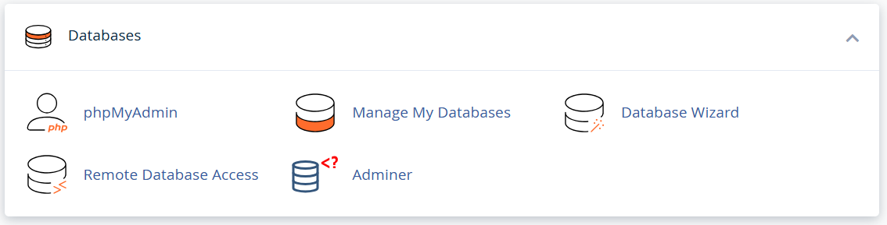

# Adminer for cPanel

Adds [Adminer](https://www.adminer.org/) to the Databases group of cPanel, next to
phpMyAdmin, and logs the user in without asking for a password - the same way cPanel
logs them into its own database tool.

One file of 500 kB, a stylesheet which makes it look like cPanel, and one icon. It
touches no account, database or cPanel setting.



## Install

Download the archive from the
[releases](https://github.com/vrana/adminer-cpanel/releases), then on the cPanel
server as root:

```bash
tar -xzf adminer-cpanel-*.tar.gz && sh adminer-cpanel/install.sh
```

The icon is bound to a cPanel feature named `adminer`, so it stays hidden until you
enable it in **WHM › Packages › Feature Manager**. That is deliberate: you can put
it on one package first and leave every other account untouched.

To update, run the same command with a newer archive - it replaces the files in place.
Adminer's own version check is switched off here: the account holder cannot install a
new version, so an offer to update would be noise, and it saves every account from
calling adminer.org on each page.

To remove it, run `uninstall.sh` from the same unpacked directory.

## Logging in

Clicking the icon opens the list of databases straight away. No password is asked for
and none is stored. Step by step:

1. **Click the Adminer icon in cPanel.**
2. cPanel opens Adminer inside your already-logged-in session, so it knows which
   account you are before the page even starts.
3. The icon's link ends in `?username=` - a deliberately empty name, which Adminer
   reads as "log me in as this account".
4. Adminer asks cPanel for a database login. cPanel creates a **temporary database
   user** for you, with access to your databases and nothing else.
5. The password for that user is already among the information cPanel hands to the
   page, so Adminer never has to invent one or ask you for one.
6. Adminer puts the real user name into the address bar and reloads, so every link
   from there on carries it.
7. Adminer notes in its own session that you are logged in - it records *that* you
   are, not the password.
8. It connects to the database server as the temporary user, fetching the password
   from cPanel afresh on every page.
9. **You land on your list of databases.** Nothing was typed, and nothing was written
   to disk or stored in a cookie.
10. If you log out, the user name drops out of the address bar and Adminer shows its
    ordinary login form.
11. When your cPanel session ends, cPanel deletes the temporary database user - so
    even a copied password stops working.

Steps 4 and 11 are the ones worth knowing: the credential reaches one account only and
expires with the session. That is not something invented here - it is the arrangement
cPanel uses for its own database tool, offered through the documented UAPI function
[`Session::create_temp_user`](https://go.cpanel.net/create_temp_user).

If the account has a `~/.my.cnf`, its `[client]` section is used instead when that call
is unavailable. Failing both, Adminer shows its ordinary login form.

## Build

```bash
php build.php
```

Produces `dist/adminer-cpanel-<version>.tar.gz` from `src/` plus the compiled
`adminer.php`, downloaded from adminer.org, and the `cpanel` design, downloaded from
Adminer's repository. Builds the current release; pass a version as an argument for a
different one. Nothing beyond PHP and `tar` is needed.

## For hosting providers

The case for offering this alongside phpMyAdmin, or instead of it:

- **It replaces two icons, not one.** If you offer PostgreSQL you are also shipping
  phpPgAdmin. Adminer covers MySQL, MariaDB, PostgreSQL, SQLite, MS SQL, Oracle
  in the same file and more with plugins: Elasticsearch, MongoDB, Redis and ClickHouse.
- **One file instead of 4308.** That is what the phpMyAdmin 5.2.3 you ship comes to,
  in 844 directories and 71 MB; Adminer is a single 508 kB file.
- **It already looks like cPanel.** The bundled design takes its colors, fonts, cards
  and buttons from Jupiter's own stylesheets, so it does not read as a foreign tool
  bolted on. The appearance is that one CSS file and behavior extends through small
  plugin files, so hiding system databases, logging queries or adding login
  restrictions is a file you drop in - and one my updates do not touch.
- **Nothing to negotiate.** Apache 2.0 or GPL 2.0, same as Adminer.

Questions, or something breaking on your fleet:
[github.com/vrana/adminer-cpanel/issues](https://github.com/vrana/adminer-cpanel/issues).

## Status

Tested on cPanel & WHM 11.136 on Ubuntu 24.04: the icon, the Feature Manager toggle,
the installer and the automatic login all work there on a stock account. Only the
Jupiter theme has been tried.
